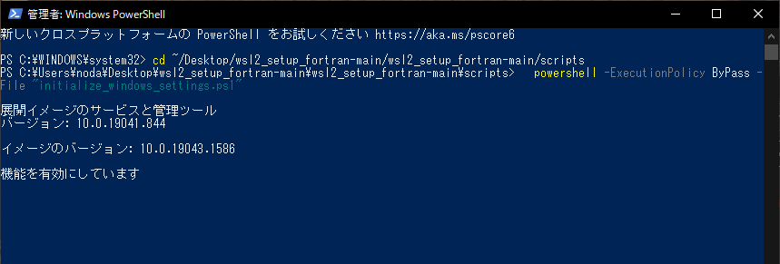
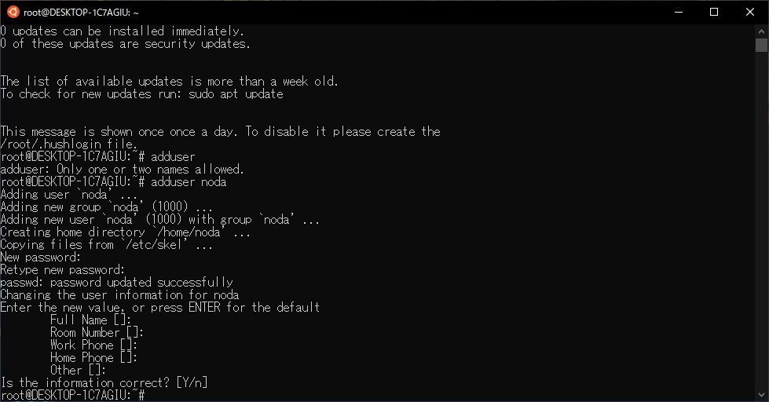
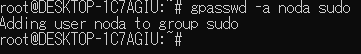
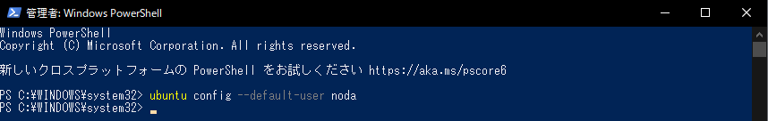
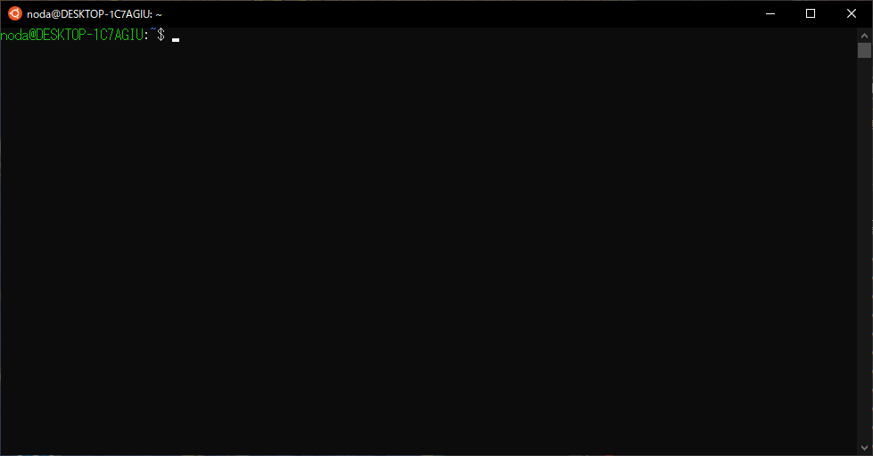
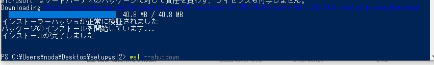
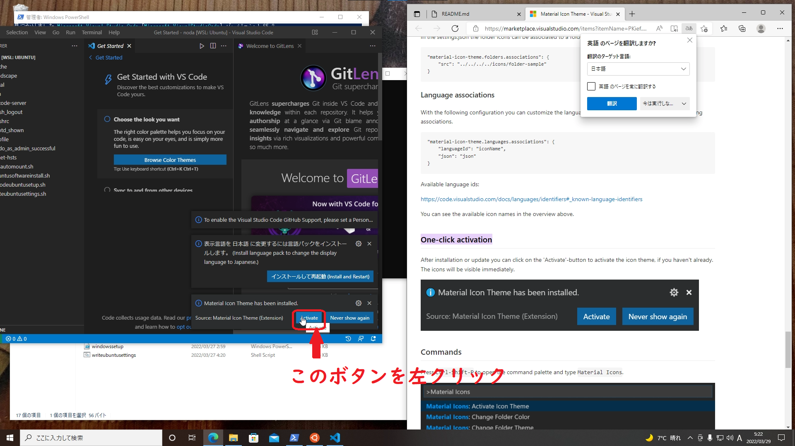
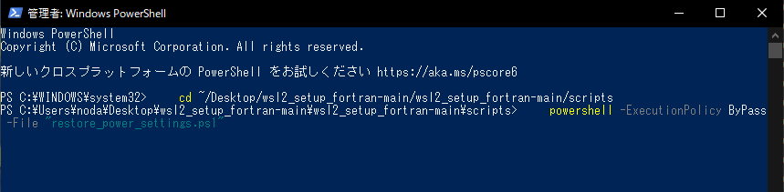

# Windows(& WSL2 Ubuntu)セットアップ説明書

<!-- vscode-markdown-toc -->
1. [はじめに](#introduction)
2. [注意](#attention)
3. [セットアップ手順](#setup)
4. [このスクリプト群はなにをしているのか？](#whatsdoingthesescripts)
5. [なぜWSL2を用いるのか？](#whydoyourecommendtousewsl2)
6. [ファイル一覧](#files)

## 1. <a name='introduction'></a>はじめに

このリポジトリはリモートサーバでFortranのコードを開発している人に向けて、できるだけ簡単にVisual Studio CodeとWSL2(Ubuntu)のセットアップを可能にするために作られたスクリプト群です  

このスクリプトを実行することで以下のことができるようになります  

- [Visual Studio Code](https://code.visualstudio.com/)でFortranのコードの開発が可能になる
- [Remote-SSH](https://marketplace.visualstudio.com/items?itemName=ms-vscode-remote.remote-ssh)を使うことで、リモートサーバのファイルをVisual Studio Codeを使って直接編集できるようになる([一定以上のバージョンのOS](https://code.visualstudio.com/docs/remote/linux)がインストールされているサーバのみ)
- [Modern Fortran](https://marketplace.visualstudio.com/items?itemName=krvajalm.linter-gfortran)を用いることで、Visual Studio Codeで開発中に、シンタックスハイライトやリンティングなどの開発に便利な機能を使用できるようになる
- $HOME/.ssh/configを編集することで、sshやrsync,scpなどのコマンドの手順を簡略化できるようになる

## 2. <a name='attention'></a>注意

- 各コマンドは選択してctrl+cでコピー、右クリックで貼り付けすることができます(Powershellはctrl+vで貼り付けできますが、Ubuntuはデフォルトではctrl+vで貼り付けができないので、右クリックで貼り付けを行ってください)

- 必要なファイルはスクリプトの最初に自動的に確認され、ファイルが足りない場合はスクリプトは途中で終了し実行されないように作っています  
  > (カスタムを行いたい方へ)  
  > 必要のないスクリプトがあるなどカスタムをしたい場合は./windowssetup.ps1の# Check whether scripts are existのブロックのコードを無効化、もしくは必要ないスクリプトのみファイル存在チェックを外すなどして対応してください  

- インターネットとの通信がかなりあるので<span style="color:darkorange">高速で安定なネットワーク(できれば有線)環境下で実行してください</span>

- ノートパソコンの場合<span style="color:darkorange">充電の残量</span>にも注意してください(基本的には充電しながらのセットアップを推奨します)

## 3. <a name='setup'></a>セットアップ手順

### 3.1. リポジトリのダウンロードと配置

- [このリポジトリ](https://github.com/kohei-noda-qcrg/wsl2_setup_fortran)にアクセスして<span style="background-color:darkgreen;color:white">Code</span>からZipファイルをダウンロードします(ブラウザの幅が小さいとCodeボタンが表示されないことがあるので、その場合はブラウザを全画面表示にしてください)


- セットアップ手順を簡単にするためダウンロードしたzipファイル(wsl2_setup_fortran-main)を<span style="color:darkorange">デスクトップに配置</span>してください  
(powershellやwsl2に慣れている人は以降のコマンドのパスをzipファイルを展開したあとのフォルダのパスに置き換えて実行してもらってもよいです)

  以下の画像のようにwsl2_setup_fortran-mainフォルダがデスクトップにあればOKです  
  

- デスクトップに配置したzipファイルの上で右クリックし、すべて展開(T)...を選択します
  

- 以下のようなウィンドウが表示されるので展開(E)を選択します
  

- 以下の画像のようにデスクトップにwsl2_setup_fortran-mainフォルダが表示されればOKです
  

### 3.1. Windows上の開発ツール等のインストール
- まずはあなたがログイン中のWindowsユーザがWindowsの管理者であることを確認します(管理者でないと以降の作業がうまくいきません)
  - windowsの設定 → アカウント → ユーザの情報 で表示されるユーザのアイコンの下に管理者(又はAdministrator)という文字列があることを確認できればOKです
  - [windowsの設定がどこにあるかわからない場合はこちらを参照してください](https://support.microsoft.com/ja-jp/windows/windows-10-%E3%81%A7%E8%A8%AD%E5%AE%9A%E3%82%92%E8%A6%8B%E3%81%A4%E3%81%91%E3%82%8B-6ffbef87-e633-45ac-a1e8-b7a834578ac6)
  - 管理者でない場合、このスクリプト群は使えないので[管理者になる方法を参照](https://www.fmworld.net/cs/azbyclub/qanavi/jsp/qacontents.jsp?PID=8610-8270)してください

- powershellを<span style="color:darkorange">管理者で実行</span>します  
  


- 以下のコマンドを実行(WSL2の機能の有効化とWindowsのインストール系スクリプト以外の処理をします)

  ```powershell
    cd $home/Desktop/wsl2_setup_fortran-main/wsl2_setup_fortran-main/scripts
    powershell -ExecutionPolicy ByPass -File "initialize_windows_settings.ps1"
  ```

  
  
  <details><summary style="color:red">!!! cd : パス 'C:\Users\(任意の文字列)' が存在しないため検出できません。と出てきて進めない場合ここをクリック !!!</summary><div>
  
  > [理由]  
  > あなたが展開したスクリプトの場所が  
  > $home/Desktop/wsl2_setup_fortran-main/wsl2_setup_fortran-main/scripts ではないことによって起こっている問題です  
  > (以降 cd $home/Desktop/wsl2_setup_fortran-main/wsl2_setup_fortran-main/scripts をするような指示がいくつかありますが、これらをすべて以下の正しいスクリプトの場所にcdするようにしてください)  
  > [解決法]  
  > よくあるスクリプトの場所は  
  > $home/Desktop/wsl2_setup_fortran-main/scripts なので  
  > ```sh
  >  cd $home/Desktop/wsl2_setup_fortran-main/scripts
  > ```
  > としてエラーが出なければ  
  > ```powershell
  >  powershell -ExecutionPolicy ByPass -File "initialize_windows_settings.ps1"
  > ```
  > を続けて実行してください
  > cd $home/Desktop/wsl2_setup_fortran-main/scripts でもエラーが発生する場合は  
  > 前の手順で展開したzipファイル(zipファイル自体ではなく展開したほうのフォルダです)の[パスをこのリンクを参考にコピー](http://faq3.dospara.co.jp/faq/show/4883?category_id=22&site_domain=default#anc02)して
  > ```powershell
  >  cd コピーしたパスを張り付ける(ctrl+vで張り付け可能です)
  >  powershell -ExecutionPolicy ByPass -File "initialize_windows_settings.ps1"
  > ```
  > を実行してください。以上で問題は解決するはずです
  > (※以降 cd $home/Desktop/wsl2_setup_fortran-main/wsl2_setup_fortran-main/scripts をするような指示がいくつかありますが、これらをすべて以上の手順のうちエラーが出なかった正しいスクリプトの場所にcdすることを忘れないようにしてください)
  

  </div></details>
  
  <span style="color:darkorange">Windowsを一度再起動</span>してから再度powershellを管理者権限で開いて以下を実行(各種ソフトウェアのインストールをします)  

  ```powershell
    cd $home/Desktop/wsl2_setup_fortran-main/wsl2_setup_fortran-main/scripts
    powershell -ExecutionPolicy ByPass -File "windowssetup.ps1"
  ```

  

  > <注記>  
  > ソフトウェアのインストールには[winget](https://github.com/microsoft/winget-cli)を使っていますが  
  > [wingetコマンド実行中は文字コードがConsolasに変更されて文字化け](http://mystia04.net/?p=961)します  
  > 動作には問題ないため文字化けに関しては無視してください(スクリプトの実行が終了すると文字化けが解消されます)

  ↓文字化けの様子  
  

  <details><summary style="color:red">Ubuntuが起動してこなかったらここをクリック！</summary><div>

  > <UbuntuがうまくインストールできずにUbuntuが起動してこない場合>  
  > まずはWindowsキーを押して、Ubuntuで検索してアプリがヒットしないことを確認してください  
  > アプリがヒットしない場合は、管理者権限でpowershellを立ち上げて  
  > wsl --install  
  > wsl --set-default-version 2  
  > wsl --install -d Ubuntu  
  > wsl --set-default Ubuntu  
  > を1行ずつ実行してどんなエラーが出るかを確認してください  
  > エラーを確認したら[Microsoft公式のWSLインストールに関するトラブルシューティングのリンク](https://docs.microsoft.com/ja-jp/windows/wsl/troubleshooting#installation-issues)を参照して  
  > 該当の項目を探して対応してください  
  > よくあるインストールできない理由は、BIOSで仮想化が無効化されているパターンです  
  > BIOS設定の変更方法はCPUやメーカーによって違うので[Intelで検索](https://www.google.com/search?q=intel+virtualization+BIOS)または[AMDで検索](https://www.google.com/search?q=AMD+virtualization+BIOS)して調べるか、PC本体のマニュアルを参照してください

  </detail>

### 3.2. WSL2上のUbuntuのセットアップ

- 1.のセットアップの途中でUbuntuが立ち上がっているはずなのでUbuntu用のユーザ名とパスワードを作成(以下のリンクのUbuntu用ユーザアカウントの設定の部分だけ実行してください)  
  [ユーザ名とパスワードの設定方法のリンク](https://www.aise.ics.saitama-u.ac.jp/~gotoh/HowToInstallUbuntu2004OnWSL2.html#:~:text=%E5%88%9D%E6%9C%9F%E8%A8%AD%E5%AE%9A%E3%81%8C%E7%B5%82%E3%82%8F%E3%82%8B%E3%81%A8%E3%83%AD%E3%82%B0%E3%82%A4%E3%83%B3%E5%90%8D%E3%81%8C%E6%B1%82%E3%82%81%E3%82%89%E3%82%8C%E3%82%8B%E3%80%82)

  ユーザを正しく作成できたら以下のような画面になっているはずです  
    

  <details><summary style="color:red">ユーザ作成がうまくいかなかったらここをクリック！</summary><div>

  > <ユーザ作成がうまくいかなかった場合>  
  > 途中でUbuntuが強制終了するなどしてユーザが正常に作成出来なかった場合は  
  > Windowsキーを押して、Ubuntuで検索してUbuntuを立ち上げると以下のようなrootという文字列が表示されるはずです  
  >   
  >
  > - rootという文字列が表示されてこない場合  
  >
  >   この場合は、念のため一度セットアップをやり直しましょう  
  >   powershellを管理者権限で開いて以下のコマンドを実行します
  >
  >   ```powershell
  >     cd $home/Desktop/wsl2_setup_fortran-main/wsl2_setup_fortran-main/scripts
  >     powershell -ExecutionPolicy ByPass -File "reset.ps1"
  >   ```
  >
  >   実行が終わったらWindowsを再起動した後、[セットアップ手順](#setup)からやり直してください
  >   reset.ps1も正常に動かない場合は
  >
  >   [Ubuntuのリセット方法](https://qiita.com/PoodleMaster/items/b54db3608c4d343d27c4#-ubuntu%E3%81%AE%E3%83%AA%E3%82%BB%E3%83%83%E3%83%88%E6%96%B9%E6%B3%95)を参考にしてUbuntuをリセットし、Windowsを再起動した後、[セットアップ手順](#setup)からやり直してください
  >
  > - rootという文字列が表示された場合  
  >
  >   Ubuntuで
  >
  >   ```sh
  >     adduser 作りたいユーザ名
  >   ```
  >
  >   を実行するとユーザを作成できます  
  >   このとき2回のパスワード入力後にもいくつかの質問項目が表示され、答えるように促されますが無視して何も入力せずEnterキー連打で構いません  
  >   正しく実行できると以下のような表示になります  
  >     
  >   次に以下のコマンドを実行します  
  >
  >   ```sh
  >     gpasswd -a 作ったユーザ名 sudo
  >   ```
  >
  >   正しく実行できたら以下のような表示になります  
  >     
  >   次にpowershellを開いて以下のコマンドを実行します
  >
  >   ```powershell
  >     ubuntu config --default-user 作ったユーザ名
  >   ```
  >
  >   
  >
  >   Ubuntuを閉じて再度起動し以下の画像のように作ったユーザ名が表示されれば設定は完了です  
  >     
  >   正しく実行できたら次の項目に進んでください  

  </div></details>
- WSL2用のスクリプトをwindowsからUbuntuにコピー

  powershellを新しく管理者権限で開き、以下のコマンドを実行します

  ```powershell
    cd $home/Desktop/wsl2_setup_fortran-main/wsl2_setup_fortran-main/scripts
    powershell -ExecutionPolicy Bypass -File "copy.ps1"
  ```

  正しく実行出来た場合、Ubuntuでlsと入力し、Enterを押すと以下の画像のように4つのファイルがあるはずです  
  
- UbuntuでWSL2用のスクリプトを実行  

  ```sh
    $HOME/writeubuntusettings.sh && $HOME/ubuntusoftwareinstall.sh
  ```

  

  スクリプトの実行時にパスワードを聞かれるので先ほどUbuntu用に設定したパスワードを入力してください  
  <details><summary  style="color:red" style="color:red">途中でUbuntuが強制終了したり、正常にスクリプトが終わらなかったらここをクリック！</summary><div>

  > <途中でUbuntuが強制終了した場合>  
  > スクリプト実行中にパッケージのエラー等によりUbuntuが強制終了する場合があります  
  > その場合は一旦Ubuntuをシャットダウンしてから$HOME/ubuntusoftwareinstall.shを実行しなおしてください  
  >
  > (実行コマンド)
  >
  >  Powershellを起動してWSLをシャットダウン  
  >
  >  ```powershell
  >    wsl --shutdown
  >  ```
  >
  > 
  >
  >  [windows keyからUbuntuを検索](https://www.google.com/search?q=+%E3%82%A2%E3%83%97%E3%83%AA+%E6%A4%9C%E7%B4%A2+windowskey)して起動  
  >  
  >
  >  $HOME/ubuntusoftwareinstall.shを実行しなおす
  >
  >  ```sh
  >    $HOME/ubuntusoftwareinstall.sh
  >  ```
  >
  > 実行しなおしてもスクリプトの最終出力である  
  > WSL2 ubuntu setting write script ended. Please restrat WSL2.  
  > が表示されない場合は、画面に解決方法が書いてあるはずなので  
  > そのコマンドを実行してから再度$HOME/ubuntusoftwareinstall.shを実行しなおしてください  

  <div></details>

  ↓正常にセットアップが終了した際の表示  
  

- WSLを再起動

  Powershellを起動してWSLをシャットダウン  

  ```powershell
    wsl --shutdown
  ```

  

  [windows keyからUbuntuを検索](https://www.google.com/search?q=+%E3%82%A2%E3%83%97%E3%83%AA+%E6%A4%9C%E7%B4%A2+windowskey)して起動  
  

- UbuntuでVScode用のスクリプトを実行  

  ```sh
    $HOME/vscodeubuntusetup.sh
  ```

  

- VScodeが起動してくるのでMaterial Icon Themeを有効化  
  [Material Icon ThemeのOne-click activation](https://marketplace.visualstudio.com/items?itemName=PKief.material-icon-theme#:~:text=One%2Dclick%20activation)を参考にして有効化してください(見つからないときはVSCodeの右下のベル🔔のマークをクリックすると有効化またはactivateというボタンが出てきます)  
  

### 3.3. 電源プランをデフォルトに戻す

  ここまでで自動実行に時間がかかるスクリプトは終了なので、initialize_windows_settings.ps1内で変更していた電源プラン(スリープしないようにする設定)をデフォルトに戻します  
  powershellを管理者権限で開いて以下のコマンドを実行します  

  ```powershell
    cd $home/Desktop/wsl2_setup_fortran-main/wsl2_setup_fortran-main/scripts
    powershell -ExecutionPolicy ByPass -File "restore_power_settings.ps1"
  ```

  

  正常にスクリプトが終了しない場合は[電源プランの設定方法のリンク](https://pc-karuma.net/windows10-power-settings/#%E9%9B%BB%E6%BA%90%E3%83%97%E3%83%A9%E3%83%B3%E3%81%AE%E5%A4%89%E6%9B%B4)を参照して電源プランを<span style="color:red">"do_not_turn_off"以外</span>にしてください(オススメは"バランス"です)

### 3.4. SSHの設定

  <span style="color:darkorange">計算機へのログインのためのユーザを作成済み</span>の場合、以下の設定を行ってください 
  
- sshの設定はUbuntuとWindowsの2つ行います
- ただしVSCodeのremote-sshの機能を使ってリモートでしか作業しないなら、Windowsのsshの設定のみで構わないです
- 秘密鍵はOpenssh形式のものを用いてください

#### Windowsのssh設定

- windowsのssh設定は $home/.ssh/config というファイルで行います
  - WSLを開発に使わないならsshの設定はWindowsだけで十分です
  
<$HOME/.ssh/configのテンプレート>

```config
ServerAliveInterval 60
ServerAliveCountMax 10

Host ims
    HostName ccfep.center.ims.ac.jp
    User {USER_NAME}
    IdentityFile {IdentityFilePath}
    ForwardX11  yes
    ForwardX11Trusted yes
```
    
#### Linuxのssh設定

- 権限の変更(公開鍵認証の場合)  
  Ubuntuで以下のコマンドを実行
(例) C:\Users\noda\\.ssh\ims_rsa という秘密鍵ファイルを持っている場合、Ubuntuで以下のコマンドを実行

    ```sh
      chmod 600 /mnt/c/Users/noda/.ssh/ims_rsa
    ```

- [$HOME/.ssh/config](https://qiita.com/passol78/items/2ad123e39efeb1a5286b#sshconfig%E3%82%92%E6%9B%B8%E3%81%8F%E3%81%A8%E4%BD%95%E3%81%8C%E5%AC%89%E3%81%97%E3%81%84%E3%81%8B)の編集  
  Ubuntuで以下のコマンドを実行

    ```sh
      nano $HOME/.ssh/config
    ```

    こんな感じの画面が表示されるはずです  
    <span style="color:darkorange">矢印キーで移動,ctrl+sで上書き保存,ctrl+xでnanoを閉じられます</span>  
      

- ssh設定のテンプレートファイルが開かれるので編集してください  

    <$HOME/.ssh/configのテンプレート>

    ```config
      ServerAliveInterval 60
      ServerAliveCountMax 10

      Host ims
        HostName ccfep.center.ims.ac.jp
        User {USER_NAME}
        IdentityFile {IdentityFilePath}
        ForwardX11  yes
        ForwardX11Trusted yes
    ```

    ここまでの設定を行うとUbuntuで

    ```sh
      ssh ims
    ```

    などと打ち込むだけでsshサーバにログイン可能になります  
    [scpコマンド](https://runble1.com/scp-config/#toc2)などもimsなどのHost名で指定できるのでコマンドの簡略化につながります

### 3.5. 分子研のファイルをVScodeで編集可能にする

  > **!!!!!!!!!!! 注意 !!!!!!!!!!!  
  > この手順を行うと自動マウントの設定が行われるため  
  > Ubuntuの起動とsource $HOME/.profileの実行完了に時間がかかるようになります  
  > 従って分子研でプログラム開発を行っていて、かつVScodeを使って編集したい場合のみ以下の手順を実行してください**

  <details><summary style="color:red">ここをクリックしてコマンドを表示</summary>

  > 以下のコマンドをUbuntuで実行してください
  >
  > ```sh
  >  $HOME/imsautomount.sh
  > ```
  >
  > 実行時、分子研のユーザ名の入力を求めるように作ってあります  
  > 聞かれたら分子研のユーザ名を入力してください  
  > source $HOME/.profile を実行するか、Ubuntuの再起動後に設定が適用されます  
  > (免責事項 : ユーザデータの取得が目的ではなく、ディレクトリの作成と自動マウントコマンドの作成にユーザ名を使用しています。ユーザデータをサーバ等に送信はしていません。スクリプトの内容は cat $HOME/imsautomount.sh ですべて確認できます。)  
  > 後から自動マウントをしないように変更したい場合、まずUbuntuで
  >
  > ```sh
  >   imsumount
  > ```
  >
  > を実行した後(Ubuntuのパスワードの入力が求められる場合があります) $HOME/.profileの以下の内容を削除してください  
  >
  > ```config
  > alias mount='sshfs -o uid=`id -u` -o gid=`id -g` -o allow_other -o nonempty ims:/home/users/分子研でのユーザ名 $HOME/分子研でのユーザ名'
  > if [ "$(ls $HOME/分子研でのユーザ名)" ]; then
  >      echo "$HOME/分子研でのユーザ名 is not empty."
  > else
  >      mount  
  > fi
  > alias imsumount='sudo umount -f $HOME/分子研でのユーザ名'
  > ```
  >
  > source $HOME/.profile を実行するか、Ubuntuの再起動後に設定が適用されます  
  </details>

### 3.6. Cisco anyconnectのインストール(HINET外部のネットワークから HINET内部のコンピュータ接続時に必要)

- 以下のリンクにアクセスしてCisco anyconnectをダウンロード  
[https://www2.media.hiroshima-u.ac.jp/sso/vpngw/anyconnect-win-4.10.05085-core-vpn-predeploy-k9.msi](https://www2.media.hiroshima-u.ac.jp/sso/vpngw/anyconnect-win-4.10.05085-core-vpn-predeploy-k9.msi)

- ダウンロードしたファイルをダブルクリック、ダウンロード

  詳しい使い方は [https://www.media.hiroshima-u.ac.jp/services/hinet/vpngw/#setting](https://www.media.hiroshima-u.ac.jp/services/hinet/vpngw/#setting) を参照してください

## 4. <a name='whatsdoingthesescripts'></a>このスクリプト群はなにをしているのか？

以下のことを自動実行しています

- Windows(powershellを管理者で実行できない場合は電源設定以外のこれらの設定を手動で行ってください)
  - <a name='intializewindowssettings'></a>initialize_windows_settings.ps1
    - スクリプト実行中に[Windowsが勝手にスリープ状態にならないようにする](https://docs.microsoft.com/ja-jp/windows-hardware/design/device-experiences/powercfg-command-line-options)
    - [Cisco any connectの設定](https://zenn.dev/hashiba/articles/wls2-on-cisco-anyconnect#%E3%83%AB%E3%83%BC%E3%83%86%E3%82%A3%E3%83%B3%E3%82%B0%E3%81%AE%E8%A8%AD%E5%AE%9A)(Ubuntu使用時)
    - WSL機能の有効化
    - WSL用のXserverの設定
  - <a name='windowssetup'></a>windowssetup.ps1
    - 必要なソフトウェア[VScode](https://code.visualstudio.com/), [7zip](https://sevenzip.osdn.jp/), [WinSCP](https://winscp.net/eng/index.php), [Git for windows](https://gitforwindows.org/), [Windows Terminal](https://www.microsoft.com/ja-jp/p/windows-terminal/9n0dx20hk701), [Teraterm](https://ttssh2.osdn.jp/index.html.ja), [VcXsrv](https://sourceforge.net/projects/vcxsrv/)のインストール
    - [WSLおよびUbuntuのインストール](https://docs.microsoft.com/windows/wsl/install)
- WSL2
  - <a name='writeubuntusettings'></a>writeubuntusettings.sh
    - [DNSの不備が生じる可能性](https://zuntan02.hateblo.jp/entry/2020/08/07/120007)を排除するため使用するDNSサーバを8.8.8.8に固定化
    - /etc/wsl.confに[automount]のオプションを加えることで[UbuntuからWindowsのファイルの権限を変更可能にする](https://riosu.hateblo.jp/entry/2018/09/12/205117)
    - (分子研環境用)分子研のファイルをVScodeを使って編集するために/etc/fuse.confにuser_allow_otherを追加
    - Xサーバを用いてGUIアプリを開くときのDISPLAYの設定がWSL起動時に毎回変わるので[DISPLAYの設定自体を自動化](https://github.com/microsoft/WSL/issues/4106#issuecomment-721750322)
    - $HOME/.ssh/configにsshの設定のテンプレートを作成
    - [localeの設定](https://askubuntu.com/questions/683406/how-to-automate-dpkg-reconfigure-locales-with-one-command)(en_US-UTF8に設定しています)
  - <a name='ubuntusoftwareinstall'></a>ubuntusoftwareinstall.sh
    - OSのアップデート
    - gcc,gfortran関連で必要なライブラリをインストール
    - (分子研環境用)[sshfs](https://github.com/libfuse/sshfs/blob/master/README.rst)をインストール
    - python,pipをインストール
    - pythonのデフォルトバージョンを3系に設定
    - gfortranをインストール
    - pythonのライブラリのインストール
  - <a name='vscodeubuntusetup'></a>vscodeubuntusetup.sh
    - Fortran開発のためのVScodeの設定ファイルの作成
    - VScode拡張機能のインストール
  - imsautomount.sh(分子研環境用)
    - Ubuntuログイン時に$HOME/分子研でのユーザ名に分子研の/home/users/分子研でのユーザ名を[マウント](https://atmarkit.itmedia.co.jp/ait/articles/1802/15/news035.html)する設定

## 5. <a name='whydoyourecommendtousewsl2'></a>なぜWSL2を用いるのか？

- Windowsを使いつつ、簡単に(ほぼ)Linuxの環境も実行可能だからです
  - [WSL2についての公式のFAQ(WSLの利点についても書かれています)](https://docs.microsoft.com/ja-jp/windows/wsl/faq)
  - [WSL2を用いた開発環境の構築についての公式記事](https://docs.microsoft.com/ja-jp/windows/wsl/setup/environment)

## 6. <a name='files'></a>ファイル一覧

- img (README用画像フォルダ)
- scripts (スクリプト&設定ファイル保存フォルダ)
  - config.xlaunch (Xサーバ設定用ファイル)
  - copy.ps1 (WindowsからUbuntuにファイルコピーをするスクリプト)
  - copyfile.bat (ダブルクリックでcopy.ps1を実行するためのファイル)
  - do_not_power_off.pow (スクリプト実行中に勝手にスリープ状態にならないようにするための設定ファイル)
  - enable_wsl2_feature.ps1 (WSL2の機能を有効化するスクリプト)
  - imsautomount.sh (分子研で開発する人のためのスクリプト)
  - initialize_windows_settings.ps1 (WSL2の機能の有効化とWindowsのインストール系スクリプト以外の処理)
  - restore_power_settings.ps1 (セットアップが終わったあとにもとの電源プランに戻すスクリプト)
  - setup.bat (Windowsの管理者権限を持っていない人用(いくつかのソフトウェア、タスクの設定は拒否されるため自動化できません))
  - ubuntusoftwareinstall.sh (Ubuntuのソフトウェア一括インストールスクリプト)
  - Update Anyconnect Adapter interface Metric for WSL2.xml (Ubuntuとwindowsをvpnを使用中でもネットワーク的に繋がるようにする設定のファイル)
  - UpdateAnyConnectinterfaceMetric.ps1 (Ubuntuとwindowsをvpnを使用中でもネットワーク的に繋がるようにするスクリプト)
  - vscodeubuntusetup.sh (Fortran開発のためのRemote WSL VScodeの設定)
  - windowssetup.ps1 (Windowsに開発に必須/便利なソフトウェアのインストールを行うスクリプト)
  - writeubuntusettings.sh (Ubuntuの設定ファイルの書き換えスクリプト)
- README (このファイル)
